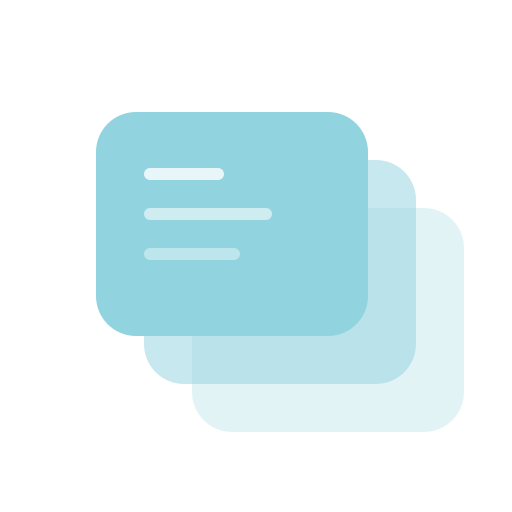
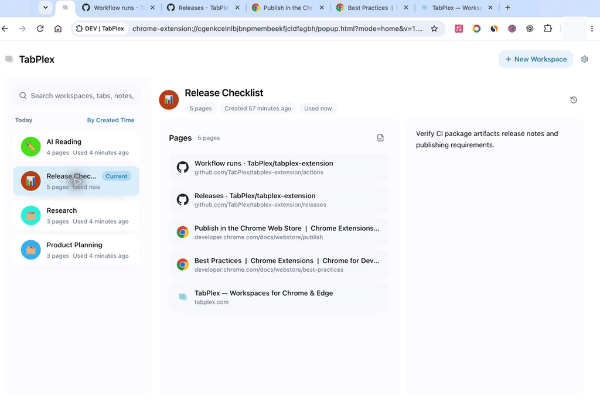

<p align="center">
  
</p>

<h1 align="center">TabPlex</h1>

<p align="center">
  Local-first, recoverable task workspaces for Chrome and Edge.
</p>

<p align="center">
  <a href="https://www.tabplex.com/">Website</a> ·
  <strong>English</strong> ·
  <a href="./README.zh-CN.md">简体中文</a> ·
  <a href="./PRIVACY.md">Privacy</a>
</p>

<p align="center">
  <a href="https://github.com/TabPlex/tabplex-extension/actions/workflows/ci.yml">
    
  </a>
</p>

<p align="center">
  
</p>

<p align="center">
  <sub>Real Chrome demo: switching workspaces replaces the current window's full tab context.</sub>
</p>

TabPlex saves a browser task—tabs, tab groups, notes, linked resources, and
recovery history—as one workspace. Switching targets only the current normal
browser window, so other windows stay untouched.

## Features

- Save complete task workspaces while preserving portable tab-group metadata.
- Switch the current window with a persistent recovery journal and rollback-safe
  restoration.
- Search workspace names, tab titles and URLs, linked resources, and notes.
- Recover earlier states through Timeline, Trash, and validated local backups.
- Export and restore portable v3 backups with bounded parsing, a SHA-256
  corruption check, preview, and transactional rollback.
- Use browser shortcuts and an optional, off-by-default local Agent control
  channel.

## Privacy and storage

The current extension has no TabPlex account, analytics client, remote workspace
API, cloud-sync runtime, or background upload path.

Workspace content and recovery data stay in `chrome.storage.local`. Temporary
window bindings use `chrome.storage.session`, while a small set of portable
preferences uses browser-managed `chrome.storage.sync`. Backups are written only
when the user explicitly exports one.

The `unlimitedStorage` permission removes Chrome's fixed local extension-storage
quota; it does not grant access to website content or enable network uploads.
See the [privacy policy](./PRIVACY.md) for the complete boundary.

## Run locally

Use Node 24 and the pnpm version declared in `package.json`.

```bash
corepack enable
pnpm install --frozen-lockfile
pnpm dev
```

Open `chrome://extensions`, enable **Developer mode**, choose **Load unpacked**,
and select `build/chrome-mv3-dev`.

For optimized builds:

```bash
pnpm build:chrome
pnpm build:edge
```

Load `build/chrome-mv3-prod` in Chrome or `build/edge-mv3-prod` in Edge.

## Verify and package

```bash
pnpm format:check
pnpm scan:secrets
pnpm licenses:check
pnpm audit:prod
pnpm typecheck
pnpm typecheck:unused
pnpm typecheck:strictnull:core
pnpm test
pnpm build:chrome
pnpm build:edge
pnpm smoke:extension-pages -- build/chrome-mv3-prod build/edge-mv3-prod
pnpm verify:artifacts -- build/chrome-mv3-prod build/edge-mv3-prod
pnpm package:chrome
pnpm package:edge
```

Tests protect stable behavior such as storage and backup contracts, message
handlers, queues, switching state machines, and high-cost interactions. Read the
[testing standards](./docs/testing-standards.md) before adding tests.

## Optional local Agent control

Agent control is disabled by default. It uses Chrome Native Messaging and a
user-only Unix socket; it does not expose an HTTP, WebSocket, MCP, or TCP port.
Chrome requests the Native Messaging permission only when you turn the feature
on and removes it again when you turn the feature off.
Install the local host for the currently loaded extension ID:

```bash
pnpm agent:install -- --extension-id=<chrome-extension-id>
```

For Edge, append `--browser=edge`. Then open **Settings → Control** and enable
**Agent control**.

```bash
pnpm agent -- help
pnpm agent -- getState
pnpm agent -- switchWorkspace '{"workspaceId":"<id>"}'
```

The host accepts only the extension ID used during installation. Permanent
delete commands require explicit confirmation; backup restore and browser
shortcut assignment remain human-confirmed UI flows.

## Shortcuts

- Open Home / Switcher: `Alt+H`
- Quick Create Workspace: `Alt+N`
- Previous Workspace: `Alt+Up`
- Next Workspace: `Alt+Down`

Customize shortcuts at `chrome://extensions/shortcuts`.

## Contributing and license

Read [CONTRIBUTING.md](./CONTRIBUTING.md) and the
[Code of Conduct](./CODE_OF_CONDUCT.md) before contributing. Report security
issues through the private process in [SECURITY.md](./SECURITY.md).

TabPlex is licensed under [AGPL-3.0-only](./LICENSE). Bundled dependency notices
are listed in [THIRD_PARTY_NOTICES.md](./THIRD_PARTY_NOTICES.md).
